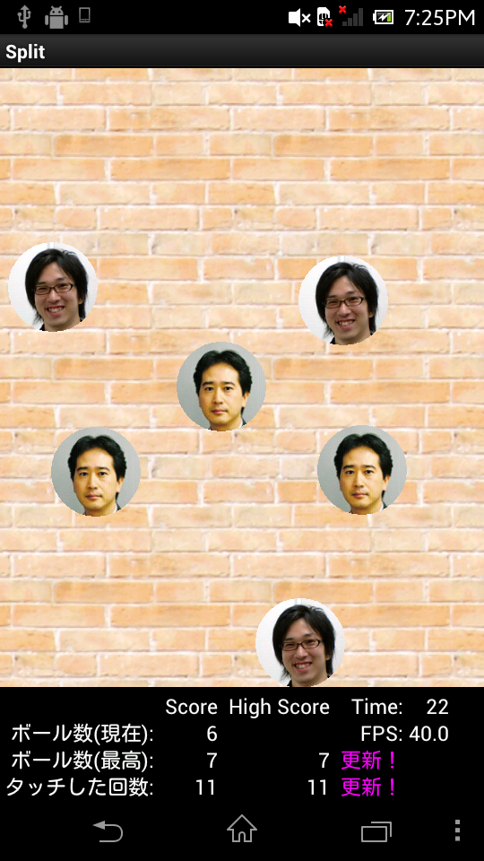
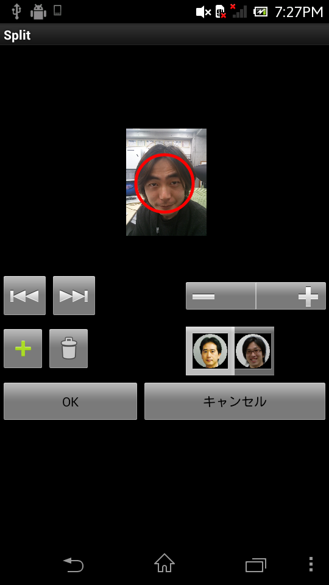

# Split #

去年の春に、僕はAndroidの資格を取りました。  
知識を得たら使ってみたくなりますが、実務で携わる機会はしばらくなさそうでした。

ちょうどその頃に社長から「会社でアプリコンテストを開く」と聞いたので、空き時間で作ってみました。

初めて書いたAndroidプログラムなのでたいしたものじゃないし、書き方が変な部分もきっとあるけど、業務外でもこれくらいはできるよ。　の目安になればと思います。  
作業時間は３週間前後。　一番つらかったことはまとまった時間がとれないことでした。

## 画面イメージ ##

## アプリが要求する権限 ##

* 端末のバイブレーションのみ。
* 個人情報とかは一切読み取りません。

## 使い方 ##

ゲーム本編はタップするとボールが分裂する。　ただそれだけ。  
ボールには好きな画像を使うことができる。  
顔認識もできるので、人物画像を取り込ませれば顔をボールにできる。  
ボール画像の変更手順がややこしいので軽く説明  
1. メニュー＞オプション設定
1. ボール画像
1. 端末のメニューボタン＞画像変更
1. ギャラリーがひらくので取り込む画像をタップ
1. 顔認識ボタン
1. 赤丸がボールになるので適当に調整してプラスボタン
1. OKボタン

＜＜ボタンや＞＞ボタンは、複数の人物が写った画像を認識させたときに、選択人物を切り替えるときに使います

## コンセプト ##

アプリコンテストでは、おそらくほとんどの人がツール系を作ってくると思ったので、ゲームなら目立つと思った。  
ゲームなんて作ったことはないので、ノウハウはなし。  
メインループ組んで、その中で判定や描画を延々と繰返すんだろうなって想像くらいしかありませんでした。  
コードはすべてフルスクラッチなので、アルゴリズムがおかしい箇所があるかもしれません。  

使った定理は
* 重力加速度 ... 放物線運動の演算
* ピタゴラスの定理 ... 接触判定で使用

細矢は物理専攻してないので事前知識はなかったですが、なんとかなりました。

## 画面の説明 ##

### スプラッシュ画面 ###
Androidでスプラッシュ画面を作ってみたかったから作った。  
一定時間で自動的に閉じる。タップするとすぐ閉じる。  
細矢はこらえしょうがないため、この仕様にした。  
⇒　一定時間経過するまでずっと待たされるスプラッシュは嫌い

### メニュー画面 ###
特に工夫なし。　タイトル画像はMS-Wordで作った(ハズ)

### ノーマルモード／エンドレスモードの画面 ###
メイン画面。  
背景とSEはフリー素材。  
BGMもフリー素材だがこちらは利用する際に作成者の表記が必要になるけど、一般公開する気はないし、面倒なので割愛。

細矢は絵が掛けないので、その他のオブジェクトはすべて単純な図形にしてすべてプログラムで書き出している。  
絵がかける人がうらやましい。

ボールが動く領域は普通のViewで作ったけどエミュレータで実行してみると処理速度があまりに遅かった。  
SurfaceViewで作り直してみるとだいぶ処理速度が改善できたが、それでもまだまだ遅くて(＝たしか20fpsくらい)途方にくれた。  
時間がとれず、OpenGLは使えなかった。  
⇒　しばらくして、Windowsのエミュレータ自体が異常に遅いことに気づいた。実機で実行してみると特に問題にならない速度だったので改善終了  
⇒　でもまあ、全体的な処理速度が向上したから結果オーライか  

↑の処理速度改善の過程で、TextViewの文字列書き換えも遅延の要因の１つになっていたため、背景も画像も文字もすべて座標演算して描画させている。  
⇒　ActivityにはSurfaceViewを１つだけしか定義していないため、一般的なAndroidアプリの作り方の参考にはならないと思う

開発中に音声認識ライブラリを見つけたので使ってみたくなった。  
ハイスコアを記録するネームエントリー画面に組み込む。  
認識結果のテキストをドロップダウン形式で表示しているが、このスクロール部分がきちんと動作していない。　けどこれまた時間がとれずに放置。

内部的にはスレッド４本立ててます。
* Androidのメインスレッド ... タッチ操作とかHomeキー押下とかを制御
* ゲーム用のスレッド ... 各種判定や描画のメインループ用
* BGMスレッド
* SEスレッド

### これまでの成績画面 ###
Androidのタブ機能を使ってみたかったので作った。  
特に工夫はない

### オプション設定画面 ###
Androidの設定画面を使ってみたかったので作った。

#### オプション設定のボールの分列数 ####
Androidの標準コンポーネントを独自拡張したカスタムビューを作ってみたかったから作った。  
⇒　スライダー形式のUIは標準コンポーネントには存在しない

#### オプション設定のボールの画像 ####
メイン画面で使うボール画像を自由に変更できるようにするために作った。

開発中に顔認識ライブラリを見つけたので、面白そうだから組み込んだ。  
ライブラリの認識結果そのままでは顔全体が囲むことができなかったので、認識結果を適当に補正している
